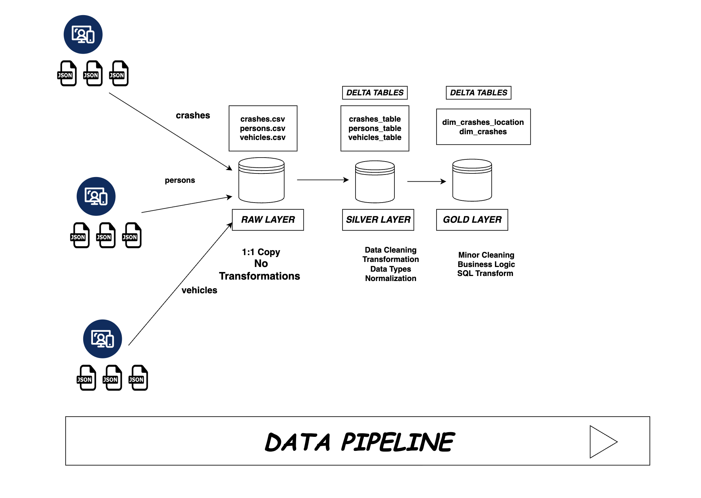
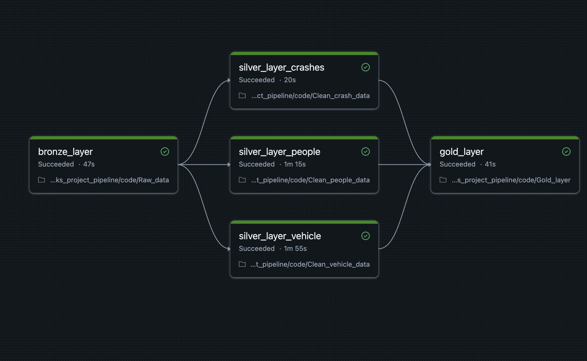
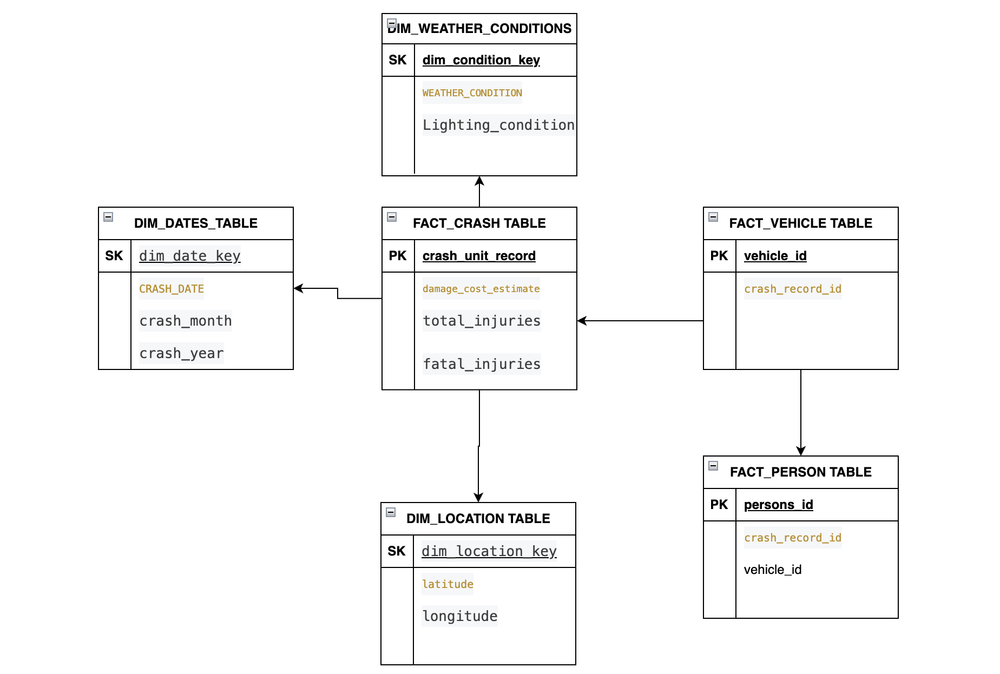
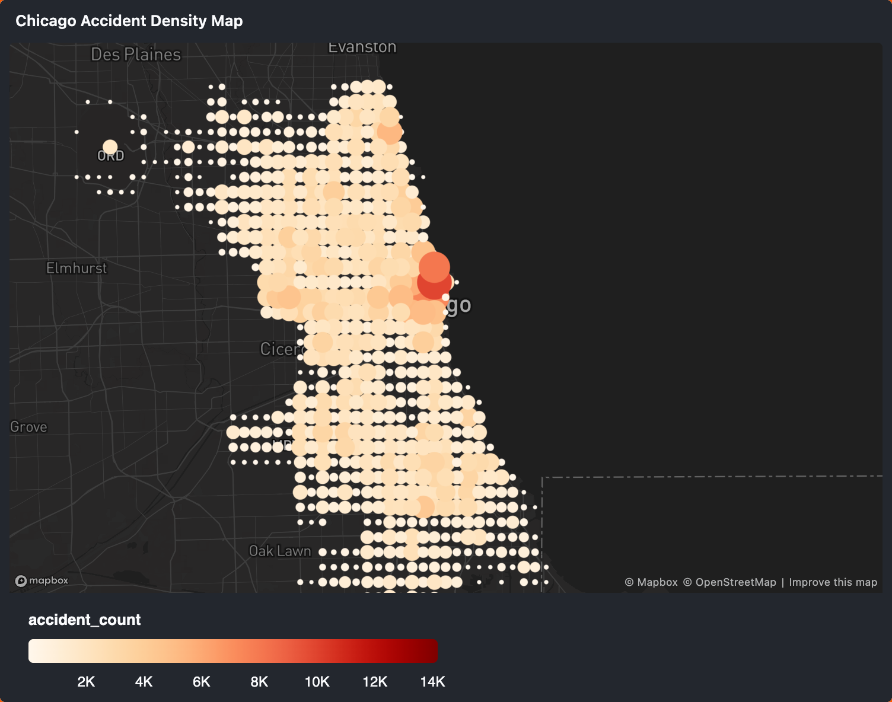

# Problem Statement
City crash data is often stored in raw, inconsistent formats, making it difficult to analyze trends such as injury severity, vehicle involvement, and demographic impact.
This project builds a scalable data pipeline to ingest, transform, and model crash data into an analytics-ready format.

# CHICAGO TRAFFIC ACCIDENTS DATA PROJECT
This project is focused on developing business logic on accidents or roadway crashes in the City of Chicago and data has been extracted from the https://data.cityofchicago.org/

Follow this link to get access to all 3 datasets
- https://data.cityofchicago.org/Transportation/Traffic-Crashes-Crashes/85ca-t3if/about_data

The focus of this project was to develop Data LakeHouse consisting of an Ingestion Layer, Storage Layer, and Consumption Layer to provide advantages like the following:
- Real Time analytics 
- Eliminate the use of multiple platforms
- Leverage the benefits of datalakes and data warehouses

### Data LakeHouse Architecture 

### Tools
- Databricks Community Edition : Delta Tables and storage was to build lakehouse 
- Apache Spark : Used for data transformation, normalisation and cleaning
- SQL : Build business logic tables for visualization

### Data Pipeline

Automated my implementation of my notebooks with the Job and Pipelines feature of the Databricks 

# Data Quality Checks
- Ensured no null crash_id
- Validated age > 0
- Removed duplicate records (person_id + crash_id) 

### Star Schema Implementation

For this project I modeled the data by implementing  star schema consisting 
- Crash_fact_table  ---> Transactional Fact Table crash level data
  - location Dim table
  - dates Dim Table
  - Weather Dim Condition
- Vehicle fact table ---> Factless Fact table vehicle-level data
- Persons fact table ---> Factless Fact table person-level data

### Data Visualization

- From the dim_crashes_location data- I applied aggregrated latitude and longitude data to develop a heat map for hot spots of accidents in the city. Locations like River North and the Loop show accident counts of 10k-15k

# Challenges and Solutions
Issue: Timestamp Parsing Errors
- Encountered malformed timestamp values
- Solution: Used safe casting (try_cast) and format standardization

