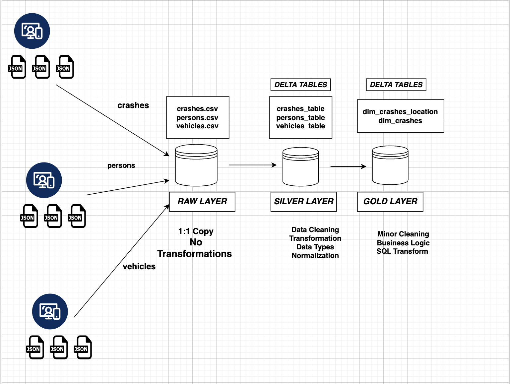

# CHICAGO TRAFFIC ACCIDENTS DATA PROJECT
This project is focused on developing business logic on accidents or roadway crashes in the City of Chicago and data has been extracted from the https://data.cityofchicago.org/

Follow this link to get access to all 3 dataset
- https://data.cityofchicago.org/Transportation/Traffic-Crashes-Crashes/85ca-t3if/about_data

Focus of this projects was to develop Data LakeHouse consisting of an Ingestion Layer, Storage Layer and Consumption Layer to provide advantages like the following:
- Real Time analytics 
- Eliminate the use of multiple platform
- Leverage the benefits of datalakes and data warehouses

### Data LakeHouse Architecture 

